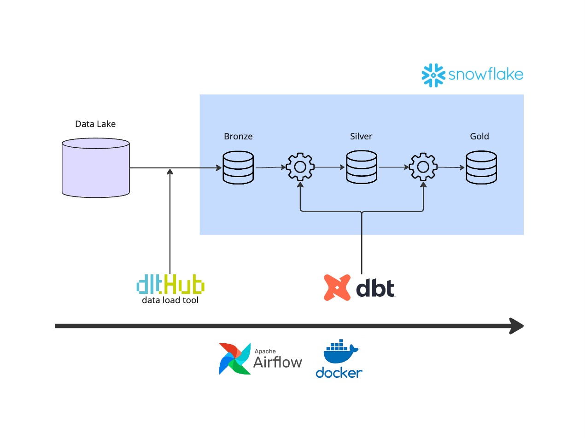

# From Messy Logs to Snowflake Insights in One Coffee Break

_A micro‑pipeline that goes from raw JSON to query‑ready tables in minutes_

I recently had a small but annoying problem: a partner dropped a handful of JSON log files into our S3 bucket every night and asked for them to show up in our Snowflake data warehouse.Spinning up an ELT platform for < 10 MB/day felt overkill, so I turned to dlt—the open‑source library that treats data loading like writing Python.

Below is the 5‑minute solution I ended up shipping. Feel free to copy–paste it into your own repo and tweak away.



## 🧐 Problem

- Data source: small JSONL files dropped in an S3 bucket once a day

- Destination: Snowflake warehouse

- Non‑goals: fancy scheduling UI, huge volume, or complex transformations

## 🚀 Solution

- Airflow orchestrates a daily DAG — sure, a cron job could have worked, but I already had Airflow up and running, so it was the path of least resistance.

- Each task is a tiny dlt pipeline that streams a file batch straight into Snowflake

- A downstream task runs dbt to create cleaned, incremental models

- Unit + dbt tests keep the contract tight

## Key dlt snippet

```python
import dlt

files= (
    filesystem(
        bucket_url=config['raw_data_dir'],
        file_glob="*.json",
        ) | read_jsonl()
)

pipeline = dlt.pipeline(
            destination="snowflake",
            dataset_name="raw",
        )

pipeline.run(
    files, table_name="event_logs", write_disposition="merge", primary_key="id"
    )
```

That’s the whole loader. dlt infers the schema and emits the Snowflake MERGE, so re‑runs land cleanly. Because both the JSON and CSV files carry a stable id column, the merge key is obvious. If you need to tweak anything, drop @dlt.resource(...) on a generator: change the primary key, switch write_disposition, filter incremental slices, or adjust schema hints—all in plain Python.

I just hooked this up to a daily Airflow DAG, and it runs like clockwork. The pipeline is idempotent, so I can re‑run it at any time without worrying about duplicates.

Data loaded, coffee over—on to the next ticket.
